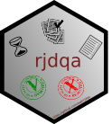

<!-- README.md is generated from README.Rmd. Please edit that file -->

```{r, echo = FALSE}
knitr::opts_chunk$set(
  collapse = TRUE,
  comment = "#>",
  fig.align = "center",
  fig.path = "man/figures/README-",
  warning = FALSE
)
```


# rjdqa  
<!--  -->

[](https://github.com/AQLT/rjdqa/actions)
[](https://cran.r-project.org/package=rjdqa)
[](https://cran.r-project.org/package=rjdqa)
[](https://cran.r-project.org/package=rjdqa)
[](https://cran.r-project.org/package=rjdqa)

## Overview

rjdqa is an extension of the R package [RJDemetra](https://github.com/rjdverse/rjdemetra), which is an interface to JDemetra+, the seasonal adjustment software [officially recommended](https://wayback.archive-it.org/12090/20240102173448/https://cros-legacy.ec.europa.eu/system/files/Jdemetra_%20release.pdf) to the members of the ESS and the European System of Central Banks.

The rjdqa package provides help to the quality assessment by producing different dashboards.

## Installation

rjdqa relies on RJDemetra that requires Java SE 8 or later version.

```{r gh-installation, eval = FALSE}
# Install release version from CRAN
install.packages("rjdqa")

# Install development version from GitHub
# install.packages("devtools")
# devtools::install_github("AQLT/rjdqa")
install.packages("rjdqa", repos = c('https://aqlt.r-universe.dev', 'https://cloud.r-project.org'))
```

If you have troubles with the installation of RJDemetra or rjdqa, check the [installation manual](https://github.com/rjdverse/rjdemetra/wiki/Installation-manual).


# Usage

## Create Statistics Canada dashboard

The function `sc_dashboard()` reproduces Statistics Canada dashboard.
See :

KIRCHNER R., LADIRAY D., MAZZI G. L. (2018), "Quality Measures and Reporting for Seasonal Adjustment", edited by G. L. Mazzi, co-edited by D. Ladiray, European Union, Luxembourg. <https://ec.europa.eu/eurostat/web/products-manuals-and-guidelines/-/KS-GQ-18-001>

MATTHEWS S. (2016), "Quality Assurance of Seasonal Adjustment for a Large System of Time Series", 36th International Symposium on Forecasting Santander, Spain.


```{r stat_cana_dash, fig.height = 8, fig.width = 10}
library(RJDemetra)
library(rjdqa)
sa_model <- x13(ipi_c_eu[, "FR"], "RSA5c")
dashboard_data <- sc_dashboard(sa_model)
plot(dashboard_data, main = "Statistics Canada dashboard",
     subtitle = "SA with X13")
```

## Simple dashboard

```{r simple_dash}
dashboard_data <- simple_dashboard(sa_model)
plot(dashboard_data, main = "Simple dashboard - IPI FR")
```

`simple_dashboard2()` is a slightly variation of `simple_dashboard()` with smaller description text to include a table with last outliers:

```{r simple_dash_out}
dashboard_data <- simple_dashboard2(sa_model)
plot(dashboard_data, main = "Simple dashboard with outliers - IPI FR")
```
