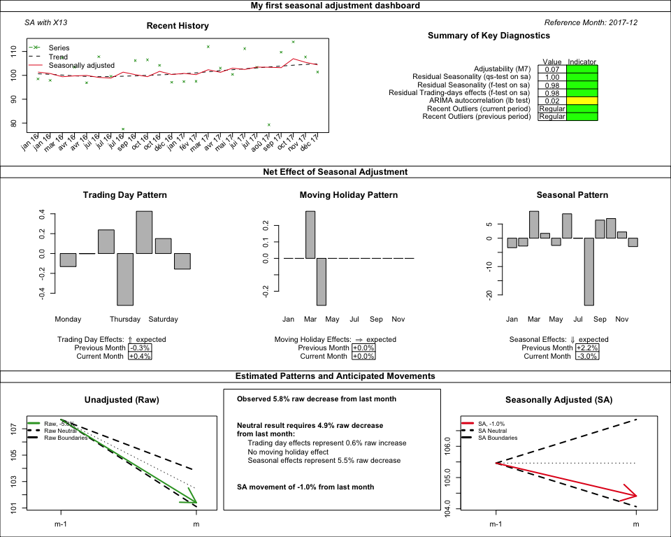

<!-- README.md is generated from README.Rmd. Please edit that file -->

# rjdqa 

[](https://travis-ci.org/AQLT/rjdqa)
[](https://cran.r-project.org/package=rjdqa)
[](https://cran.r-project.org/package=rjdqa)
[](https://cran.r-project.org/package=rjdqa)
[](https://cran.r-project.org/package=rjdqa)

## Overview

rjdqa is an extension of the R package
[RJDemetra](https://github.com/nbbrd/rjdemetra), which is an interface
to JDemetra+, the seasonal adjustment software [officially
recommended](https://ec.europa.eu/eurostat/cros/system/files/Jdemetra_%20release.pdf)
to the members of the ESS and the European System of Central Banks. The
rjdqa package provides help to the quality assessment by producing:

  - A dashboard of a seasonal adjustment model. Its goal is to provide a
    simple snapshot of an single seasonal adjustment model at a point in
    time and to point out some possible problems.  
  - A quality report matrix (in a future release). Its goal is to help
    the analyst during production, when there is very few time to detect
    and fix potential problems, by highlighting problematic series and
    prioritising the list of series to be checked.

## Installation

rjdqa relies on RJDemetra that requires Java SE 8 or later version.

You can install rjdqa from github with:

``` r
# install.packages("devtools")
devtools::install_github("AQLT/rjdqa", args = "--no-multiarch")
```

# Usage

## Create a dashboard

``` r
library(RJDemetra)
library(rjdqa)
sa_model <- x13(ipi_c_eu[, "FR"], "RSA5c")
sa_model_tramoseats <- tramoseats(ipi_c_eu[,"FR"])
dashboard_data <- sa_dashboard(sa_model)
plot(dashboard_data, main = "My first seasonal adjustment dashboard",
     subtitle = "SA with X13")
```


